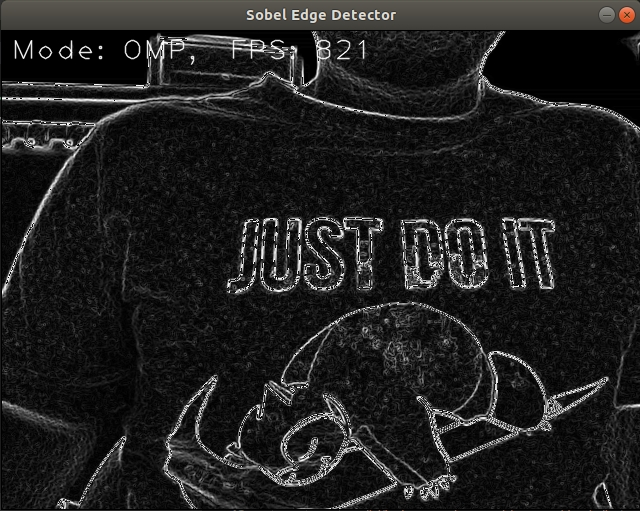

# SobelCUDA
Based on lukas783 project (which can be found here) https://github.com/lukas783/CUDA-Sobel-Filter.git, this program  
takes as input the video stream from a camera and allows to switch between CPU, OMP and GPU computation. Initially  
it was meant as "benchmark" for the Nvidia Jetson nano board, but the program is kind of generic. The image processing  
pipeline uses gstreamer and OpenCV and, of course, the nvidia cuda toolkit; be sure to have those dependencies installed.  

## Dependencies
* make
* OpenCV >= 3.4 (at least the program was written with this version. It might work even with older releases)
* gcc/g++
* Nvidia CUDA Toolkit (v10.1 was used here)

## Basic Build and Run Instructions  
1. `git clone https://github.com/Cr05512/SobelCUDA.git`
2. `cd SobelCuda`
3. `make`
4. `./test`

## Operating Mode Instructions  
After launching the program you should be able to see the RGB output.  
- Press `C` for CPU mode
- Press `O` for OMP mode
- Press `G` for GPU mode
- Press `ESC` to terminate the execution

## Note
The FPS are "theoretic", this is note a valid tool for precise benchmarking. The computation of performances relies only on  
the processing time (for the GPU mode even the MemCopy phase is considered). This program is not meant to prove anything,  
but just to give a vague idea of the speedup provided by parallelization.

